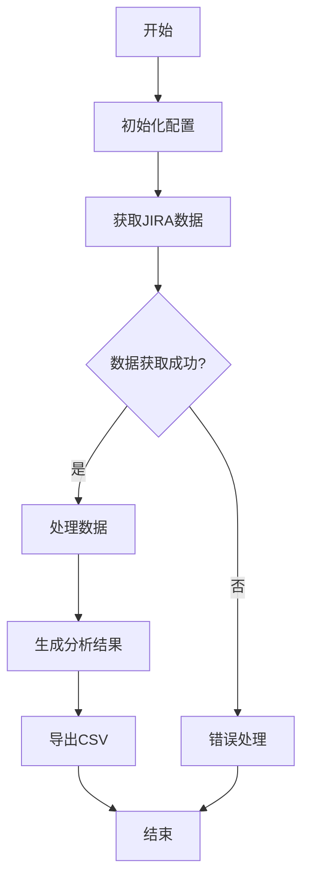

# JIRA API 数据分析工具

这是一个用于分析 JIRA 数据的 Python 工具集，主要用于跟踪和分析测试用例、故障、变更、迭代完成情况等数据。

## 设计理念

本项目旨在提供一个统一的框架来访问和分析 JIRA 数据，主要设计理念包括：

1. **模块化设计**：每个分析功能都被封装在独立的类中，便于维护和扩展
2. **代码复用**：通过 `BaseJira` 基类实现共享功能，减少重复代码
3. **数据安全**：敏感信息（如 API token）通过配置文件管理，避免硬编码
4. **可扩展性**：易于添加新的分析功能和数据源
5. **用户友好**：提供清晰的输出格式和错误处理

## 程序设计

### 核心组件

1. **BaseJira 类**
   - 提供基础的 JIRA API 访问功能
   - 管理 API token 和请求头
   - 处理通用配置和错误处理

2. **分析模块**
   - `TestCasesAnalyzer`: 测试用例分析
   - `BugProgress`: 故障跟踪分析
   - `ChangeTracking`: 变更跟踪分析
   - `IterationCompletion`: 迭代完成情况分析
   - `SprintPlanning`: 迭代规划分析
   - `TestingProgress`: 测试进度分析

3. **配置管理**
   - `config.json`: 存储 API token 等敏感信息
   - `config.template.json`: 配置文件模板

### 数据流

1. 从 JIRA API 获取原始数据
2. 处理和转换数据
3. 生成分析结果
4. 导出为 CSV 文件

## 流程图



## 安全性考虑

1. **敏感信息保护**
   - API token 存储在独立的配置文件中
   - 配置文件被添加到 `.gitignore`，防止意外提交
   - 使用配置文件模板指导用户设置

2. **访问控制**
   - 所有 API 请求都需要有效的 token
   - 请求头包含必要的认证信息

3. **错误处理**
   - 完善的异常处理机制
   - 详细的错误日志记录
   - 用户友好的错误提示

4. **数据安全**
   - 输出数据经过脱敏处理
   - 敏感信息不直接显示在日志中

## 使用说明

1. 复制 `config.template.json` 为 `config.json`
2. 在 `config.json` 中填入你的 API token
3. 运行相应的分析模块

## 依赖项

- Python 3.x
- requests
- pandas
- datetime
- os
- json

## 示例代码

```python
from jiraapi.TestCasesAnalyzer import TestCasesAnalyzer

# 创建分析器实例
analyzer = TestCasesAnalyzer()

# 运行分析
analyzer.run_analysis()
```

## 注意事项

1. 确保配置文件中的 API token 正确
2. 检查网络连接是否正常
3. 确保有足够的权限访问 JIRA API
4. 定期更新 API token 以提高安全性

## 数据字段说明

### 测试用例分析 (TestCasesAnalyzer)
- **test_plan_key**: 测试计划编号
- **total_cases**: 测试用例总数
- **passed_cases**: 通过的测试用例数
- **failed_cases**: 失败的测试用例数
- **blocked_cases**: 阻塞的测试用例数
- **not_run_cases**: 未执行的测试用例数
- **pass_rate**: 通过率（百分比）
- **case_details**: 测试用例详细信息
  - **id**: 测试用例ID
  - **name**: 测试用例名称
  - **description**: 测试用例描述
  - **status**: 执行状态
  - **priority**: 优先级
  - **component**: 所属组件

### 故障跟踪分析 (BugProgress)
- **programName**: 项目名称
- **teamName**: 团队名称
- **totalBugs**: 总故障数
- **preFixed**: PRE环境已修复数
- **uatFixed**: UAT环境已修复数
- **prePending**: PRE环境待修复数
- **uatPending**: UAT环境待修复数
- **preFixedRatio**: PRE环境修复率
- **uatFixedRatio**: UAT环境修复率

### 变更跟踪分析 (ChangeTracking)
- **teamName**: 团队名称
- **changeTasks**: 变更任务数
- **changePoints**: 变更故事点数

### 迭代完成情况分析 (IterationCompletion)
- **programName**: 项目名称
- **teamName**: 团队名称
- **plannedProgress**: 计划进度
- **actualProgress**: 实际进度
- **storypointPlanned**: 计划故事点数
- **storypointCompleted**: 完成故事点数

### 迭代规划分析 (SprintPlanning)
- **programName**: 项目名称
- **teamName**: 团队名称
- **plannedProgress**: 计划进度
- **actualProgress**: 实际进度
- **storypointPlanned**: 计划故事点数
- **storypointCompleted**: 完成故事点数
- **testPoints**: 测试故事点数
- **userStoryPoints**: 用户故事点数
- **userStoryRatio**: 用户故事占比
- **enablerPoints**: 技术需求点数
- **enablerRatio**: 技术需求占比
- **storyThroughput**: 需求吞吐量

### 测试进度分析 (TestingProgress)
- **teamName**: 团队名称
- **totalTestCases**: 测试用例总数
- **completedTestCases**: 完成的测试用例数
- **failedTestCases**: 失败的测试用例数
- **blockedTestCases**: 阻塞的测试用例数 